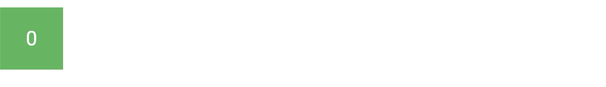

# Motion Frame

A Javascript Lambda animation engine

### Usage

To use Animate, you can use one of two functions. `motion()` or `new MotionChain()`. The `motion()` function takes in a single object with values, where as the `MotionChain` takes in an array of objects that then all play after one another.

| Key                  | Type                   | Default | Description                                                                                                                    |
| -------------------- | ---------------------- | ------- | ------------------------------------------------------------------------------------------------------------------------------ |
| ele (required)       | DOMElement             | null    | The element that is going to be animated                                                                                       |
| animation (required) | Function (instance, x) | null    | The lambda animation that will run                                                                                             |
| duration             | Number                 | 1000    | The duration of the animation in milliseconds                                                                                  |
| delay                | Number                 | 0       | The delay before the animation starts in milliseconds                                                                          |
| reverse              | Boolean                | false   | If the animation should play in reverse                                                                                        |
| reverseAfter         | Boolean                | false   | If the animation should prepare to play in reverse after a play though (Mainly used with the `loop` option)                    |
| loop                 | Boolean                | false   | If the animation should loop after it finishes                                                                                 |
| easing               | Function (x)           | linear  | The easing function that the animation will take                                                                               |
| stop                 | Boolean                | false   | If the animation should stop (Set to true if you don't want the animation the play immediately)                                |
| then                 | Function (instance)    | null    | A function that will trigger once the animation has finished (Will trigger after ever play through if `loop` is set to `true`) |

### Example

```js
motion({
	ele: document.getElementById("foo"),
	duration: 2000,
	loop: true,
	reverseAfter: true,
	easing: (x) => {
		return x < 0.5 ? 8 * x * x * x * x : 1 - Math.pow(-2 * x + 2, 4) / 2;
	},
	animation: (instance, x) => {
		let destX = (window.innerWidth - instance.eleBase.width) / 2;

		let amountX = (destX - instance.eleBase.left) * x;

		instance.ele.style.left = `${amountX}px`;
	},
	then: (x) => {
		document.getElementById("count").innerHTML = x.playCount;
	}
});
```


