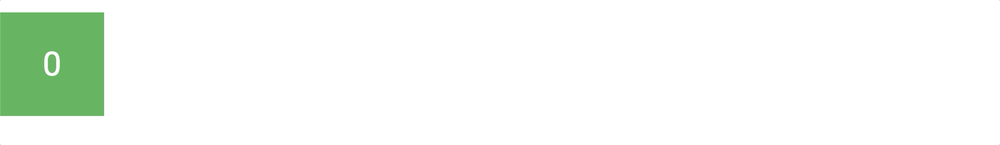

# Motion Frame

A Typescript lambda animation / easing engine built on top of requestAnimationFrame

## About

Motion Frame is an animation engine that is run off the concept of lambda animation functions. The way that these functions work is that you define the end state of an animation that you want in JS, and then multiply any values with the provided easing variable `x` (value between 0 and 1) and then let the engine work its magic :)

### Usage

To use Motion Frame, run `npm install motion-frame` and import `Motion` and / or `MotionChain` into your project. `Motion` is the main class to use to initiated your animations, while `MotionChain` allows you to chain animations together to then play in order. To use them, you need to provide an `MotionProps` object in the constructor (in the the `MotionChain`'s case, an array of `MotionProps`)

###### \* is required

| Key            | Type                 | Default         | Description                                                                     |
| -------------- | -------------------- | --------------- | ------------------------------------------------------------------------------- |
| `animation` \* | Function (x, state?) | `null`          | The lambda animation that will run                                              |
| `easing`       | Function (x)         | `(x) => x`      | The easing function that the animation will take                                |
| `duration`     | Number               | `1000`          | The duration of the animation in milliseconds                                   |
| `reverse`      | Boolean              | `false`         | If the animation should play in reverse                                         |
| `loop`         | LoopType             | `LoopType.NONE` | If the animation should loop after it finishes                                  |
| `then`         | Function (state)     | `(state) => {}` | A function that will trigger once the animation has finished each run           |
| `state`        | Object               | `{}`            | Persistent state that can be accessed within the `animation` and `then` lambdas |
| `reset`        | Function             | void            | Gets called immediately after the animation gets reset to its original position |

### Example

```ts
import { Motion } from "motion-frame";

const boxElement = document.getElementById("box");
const boxRect = boxElement.getBoundingClientRect();

const boxAnimation = new Motion({
	duration: 2000,
	loop: LoopType.ALTERNATE,
	easing: (x) => (x < 0.5 ? 8 * x * x * x * x : 1 - Math.pow(-2 * x + 2, 4) / 2),
	animation: (x) => {
		let destX = (window.innerWidth - boxRect.width) / 2;
		let amountX = (destX - boxRect.left) * x;

		boxElement.style.left = `${amountX}px`;
	},
	then: () => {
		boxElement.innerHTML = boxAnimation.playCount;
	}
});

boxAnimation.play();
```



#### TODO - Future enhancements / additions

1. Make some pre-build easing functions available
1. Create a bunch of examples for all the different features
1. Build out extra documentation and examples around `MotionChain`
1. Unit tests
